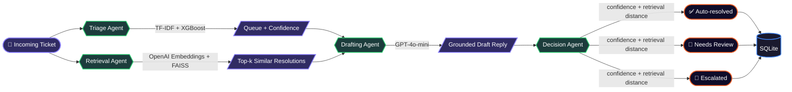

<div align="center">


<br/>


<br/><br/>


<br/><br/>


&nbsp;&nbsp;

&nbsp;

&nbsp;

&nbsp;

&nbsp;
<a href="./LICENSE"></a>

<br/><br/>


</div>

<br/>

> **AI‑Ops** reads an incoming customer support ticket, decides which team should own it, pulls up how similar issues were actually resolved before, drafts a grounded reply, and decides **for itself** — based on its own confidence, not a hardcoded rule of thumb — whether to send that reply, hold it for a human to approve, or escalate immediately. It's not a chatbot with a nice UI; it's a triage system with a measurable automation rate.

<br/>

<div align="center">

### 📑 Table of Contents

</div>

<table align="center">
<tr>
<td valign="top" width="50%">

- 🎯 [Why This Exists](#-why-this-exists)
- 🧠 [Architecture](#-architecture)
- 🖥️ [Two Interfaces, One Pipeline](#️-two-interfaces-one-pipeline)
- 🛠️ [Tech Stack](#️-tech-stack)
- 📊 [Results](#-results)
- 📁 [Project Structure](#-project-structure)

</td>
<td valign="top" width="50%">

- 🚀 [Getting Started](#-getting-started)
- 🔌 [API Usage](#-api-usage)
- 🧪 [Testing](#-testing)
- 🖼️ [Screenshots](#️-screenshots)
- 🧭 [What I'd Build Next](#-what-id-build-next)
- 💡 [Lessons Along the Way](#-lessons-along-the-way)

</td>
</tr>
</table>


## 🎯 Why This Exists

Most "AI support bot" projects are a single LLM call wearing a UI. That's not what running this in production actually looks like — and it's not what this looks like either, on purpose.

**AI‑Ops** is built the way a real support-intelligence system would be: a  does the cheap, deterministic job of routing (it doesn't need an LLM to know "this is a billing question"), a  grounds every reply in what actually worked before, an  only gets involved where genuine language generation is required, and a  weighs the model's own confidence and retrieval quality to decide whether a ticket can be safely auto-resolved, needs a human to approve the draft, or should skip straight to a person. Every layer earns its place — nothing is there just because it's trendy.

The project went through two phases. Phase 1 built the pipeline end-to-end (classifier → RAG → agents → API). Phase 2 — after realizing a working pipeline still just _felt_ like a chatbot — added persistence, real confidence scoring, and outcome-based decision logic, so the system actually behaves like a product with an audit trail instead of a stateless text-in, text-out demo.

<br/>

## 🧠 Architecture



<table>
<tr><th>Stage</th><th>Approach</th><th>Why not just "ask the LLM"?</th></tr>
<tr><td>🟣 <b>Triage</b></td><td>TF-IDF + XGBoost</td><td>Fixed category set → cheap, instant, deterministic. Paying an LLM per ticket for this is wasted cost and latency.</td></tr>
<tr><td>🔵 <b>Retrieval</b></td><td>OpenAI embeddings + FAISS</td><td>Semantic search over real historical resolutions — grounds the reply in what actually worked.</td></tr>
<tr><td>🟠 <b>Drafting</b></td><td>GPT-4o-mini</td><td>The one step that genuinely needs open-ended language generation.</td></tr>
<tr><td>🟢 <b>Decision</b></td><td>Rule-based, using model confidence + retrieval distance</td><td>Transparent, auditable logic for what gets sent automatically vs. reviewed vs. escalated — no black box on a compliance-relevant decision. High-risk queues (billing, HR, outages) never auto-send, regardless of confidence.</td></tr>
</table>

<br/>

## 🖥️ Two Interfaces, One Pipeline

The same backend pipeline is consumed by two completely different surfaces:

<table>
<tr><th>Interface</th><th>Audience</th><th>What it shows</th></tr>
<tr>
<td>🌐 <b>Customer Portal</b></td>
<td>The customer</td>
<td>A simple form to submit a request, and a lookup screen to check on it. If the system auto-resolved it, the customer sees the final answer immediately. If it was flagged for review, they see a plain holding message — never an unapproved AI draft.</td>
</tr>
<tr>
<td>🗂️ <b>Agent Console</b></td>
<td>The support team</td>
<td>A live inbox of tickets that actually need attention, split into <code>Needs Review</code>, <code>Flagged</code>, and <code>Resolved</code>, plus a read-only <code>Auto-resolved</code> log — the audit trail proving the system handles real volume on its own. A top stats bar surfaces the automation rate directly.</td>
</tr>
</table>

A third, minimal <b>Pipeline Inspector</b> view is kept separately as an internal/debugging tool — it visualizes each agent stage lighting up in sequence for a single ticket, useful for explaining the architecture, not for daily use.

<br/>

## 🛠️ Tech Stack

<div align="center">

|         Layer         | Tools                                                 |
| :-------------------: | :---------------------------------------------------- |
|      📦 **Data**      | pandas · NumPy                                        |
|  🧮 **Classical ML**  | scikit-learn · XGBoost                                |
|   🔍 **Retrieval**    | OpenAI Embeddings · FAISS                             |
| 🕸️ **Orchestration**  | LangGraph                                             |
|   ✍️ **Generation**   | OpenAI GPT-4o-mini                                    |
| 🧭 **Decision Logic** | Confidence + retrieval-distance rules (`decision.py`) |
|  🗄️ **Persistence**   | SQLite · SQLAlchemy                                   |
|   📏 **Evaluation**   | RAGAS                                                 |
|    🌐 **Serving**     | FastAPI · Pydantic · Uvicorn                          |
|    🧪 **Testing**     | pytest · unittest.mock                                |
|   📦 **Packaging**    | setuptools (`src/` layout, pip-installable)           |
|      ⚙️ **Ops**       | Docker · GitHub Actions                               |

</div>

<br/>

## 📊 Results

**Classifier — 10-class ticket routing (`queue` prediction)**

| Model                                   |  Accuracy  |  Macro F1   |
| --------------------------------------- | :--------: | :---------: |
| Logistic Regression + TF-IDF (baseline) |    46%     |    0.37     |
| **XGBoost + TF-IDF (final)**            | 🟢 **50%** | 🟢 **0.44** |

Weaker on the smallest classes (`General Inquiry`, `Sales and Pre-Sales`) — a direct effect of class imbalance, documented below rather than silently ignored.

**RAG pipeline — RAGAS evaluation (20-sample eval set)**

| Metric            |   Score   | What it measures                                    |
| ----------------- | :-------: | --------------------------------------------------- |
| Context Precision | 🟢 `1.00` | Are retrieved past tickets actually relevant?       |
| Faithfulness      | 🟡 `_.__` | Does the draft stick to the retrieved context?      |
| Answer Relevancy  | 🟡 `_.__` | Does the draft actually address the question asked? |

> _Fill in the final numbers from `notebooks/05_evaluation.ipynb`._

**Decision layer — automation outcome (live system, via `/stats`)**

| Outcome          | What it means                                                                                        |
| ---------------- | ---------------------------------------------------------------------------------------------------- |
| ✅ Auto-resolved | High confidence + strong retrieval match on a non-high-risk queue → sent with zero human involvement |
| 📝 Needs review  | Draft prepared, held for an agent to approve or edit before sending                                  |
| 🚩 Escalated     | Low confidence and/or weak retrieval match → routed straight to a human, no draft trusted            |

> _Automation rate (`% auto-resolved`) is computed live from real ticket volume via `GET /stats` — pull your current number in before sharing this README._

<br/>

## 📁 Project Structure

<details>
<summary><b>🌳 Click to expand full tree</b></summary>

```
ai-ops/
├── notebooks/                # exploration & demos — thin, call into src/
├── src/ai_ops/
│   ├── data/                  # loading, cleaning
│   ├── models/                 # classifier + training script
│   ├── rag/                     # embeddings, retriever, knowledge base
│   ├── agents/                   # LangGraph nodes, decision logic, graph assembly
│   ├── db/                        # SQLAlchemy models, session, CRUD
│   ├── evaluation/                 # classification + RAGAS metrics
│   ├── api/                         # FastAPI app, routes, schemas
│   └── utils/                        # logging, io helpers
├── frontend/
│   ├── customer-portal/       # public-facing submission + status lookup
│   ├── agent-console/          # internal inbox, review, and auto-resolved log
│   └── pipeline-inspector/      # internal dev tool — visualizes a single ticket's flow
├── tests/                    # pytest — one file per module
├── data/                     # raw / processed / knowledge_base
├── models/                   # saved artifacts (gitignored)
├── configs/                  # config.yaml
├── scripts/                  # run_pipeline.py, evaluate.py
├── .github/workflows/        # CI
├── Dockerfile
├── docker-compose.yml
└── pyproject.toml
```

</details>

<br/>

## 🚀 Getting Started

<details>
<summary><b>⚡ Click to expand setup instructions</b></summary>

```bash
# 1. Clone
git clone https://github.com/Jenil05-web/ai-ops.git
cd ai-ops

# 2. Create environment & install
python -m venv venv
source venv/bin/activate          # Windows: venv\Scripts\activate
pip install -e .

# 3. Set your OpenAI key
cp .env.example .env              # then fill in OPENAI_API_KEY

# 4. Run the pipeline
python -m ai_ops.data.cleaning          # clean raw data
python -m ai_ops.models.train           # train the classifier
python -m ai_ops.rag.knowledge_base     # build embeddings + FAISS index

# 5. Initialize the database
python -c "from ai_ops.db.database import init_db; init_db()"

# 6. Serve the API
uvicorn ai_ops.api.main:app --reload --app-dir src
```

Visit `http://127.0.0.1:8000/docs` for interactive Swagger docs. Open `frontend/agent-console/index.html` and `frontend/customer-portal/index.html` directly in a browser to use the two interfaces.

</details>

<br/>

## 🔌 API Usage

**Submit a ticket through the full pipeline (persists to DB, returns a routing decision):**

```bash
curl -X POST "http://127.0.0.1:8000/tickets?customer_email=jane@example.com&subject=Billing+question&body=I+was+charged+twice+this+month"
```

```json
{
  "id": "31245b42",
  "predicted_queue": "Billing and Payments",
  "confidence": 0.99,
  "status": "needs_review",
  "draft_response": "We apologize for the inconvenience...",
  "retrieved_context": "[ ... ]",
  "created_at": "2026-07-29T18:54:09"
}
```

**Check live automation stats:**

```bash
curl "http://127.0.0.1:8000/stats"
```

```json
{
  "total": 12,
  "auto_resolved": 9,
  "needs_review": 2,
  "escalated": 1,
  "automation_rate": 75.0
}
```

**Other endpoints:** `GET /tickets?status=needs_review`, `GET /tickets/{id}`, `POST /tickets/{id}/reply`, and the original single-shot `POST /process-ticket` (no persistence — used by the Pipeline Inspector).

<br/>

## 🧪 Testing

```bash
pytest tests/ -v
```

Every module — cleaning, classifier, RAG, agents, decision logic, and API — is unit tested with mocked external calls (no live API cost to run the suite).

<br/>

## 🖼️ Screenshots

<!-- Add screenshots here, e.g.:
<div align="center">


</div>
-->

<div align="center">
<i>Coming soon.</i>
</div>

<br/>

## 🧭 What I'd Build Next

Deliberately scoped out of this MVP — not forgotten, just sequenced:

- [ ] Fine-tune a small open model on drafting, instead of prompting GPT-4o-mini
- [ ] Priority prediction (currently only `queue` is classified)
- [ ] Class imbalance handling (SMOTE / class weighting) for minority queue categories
- [ ] Skip drafting entirely for immediate-escalation cases, to save LLM cost on tickets that will be escalated regardless
- [ ] Real-time updates via WebSockets instead of polling in the Agent Console
- [ ] Email notification to the customer once a reviewed reply is sent
- [ ] Basic auth on the Agent Console
- [ ] Real-time monitoring dashboard (latency, cost per ticket, drift detection)

<br/>

## 💡 Lessons Along the Way

- My first dataset choice looked fine on paper — until I actually _read_ the rows and found the labels had no real relationship to the text. Caught it before building three layers on top of broken data.
- A perfect retrieval score doesn't mean a good system — my RAG context precision was `1.00` while the drafted answers still scored poorly, because the problem was prompt design, not retrieval.
- "The metric didn't move" turned out to be a stale Jupyter kernel, not a bad idea — always verify your code is actually the code you think it is before trusting a number.
- After finishing the entire pipeline, it still felt like a chatbot — because every ticket ended up in front of a human either way. The fix wasn't more AI, it was adding a decision layer that used the model's own confidence to let _some_ tickets resolve with zero human involvement, and building a UI that could prove it with a real number.

<br/>


<div align="center">

### Author

**Built by Jenil**

<a href="https://github.com/Jenil05-web">

</a>
<a href="./LICENSE">

</a>

<sub>Licensed under the <a href="./LICENSE">AI-Ops Open Build License</a> — a custom permissive license written for this project.</sub>

<br/><br/>


</div>
