<div align="center">


<br/>


<br/><br/>



<br/><br/>


&nbsp;&nbsp;

&nbsp;

&nbsp;

&nbsp;

&nbsp;
<a href="./LICENSE"></a>

<br/><br/>


</div>

<br/>

> **AI‑Ops** reads an incoming customer support ticket, decides which team should own it, pulls up how similar issues were actually resolved before, drafts a grounded reply, and decides on its own whether a human needs to step in — all as one orchestrated pipeline, not a single prompt pretending to be a product.

<br/>

<div align="center">

### 📑 Table of Contents

</div>

<table align="center">
<tr>
<td valign="top" width="50%">

- 🎯 [Why This Exists](#-why-this-exists)
- 🧠 [Architecture](#-architecture)
- 🛠️ [Tech Stack](#️-tech-stack)
- 📊 [Results](#-results)
- 📁 [Project Structure](#-project-structure)

</td>
<td valign="top" width="50%">

- 🚀 [Getting Started](#-getting-started)
- 🔌 [API Usage](#-api-usage)
- 🧪 [Testing](#-testing)
- 🖼️ [Screenshots](#️-screenshots)
- 🧭 [What I'd Build Next](#-what-id-build-next)
- 💡 [Lessons Along the Way](#-lessons-along-the-way)

</td>
</tr>
</table>


## 🎯 Why This Exists

Most "AI support bot" projects are a single LLM call wearing a UI. That's not what running this in production actually looks like.

**AI‑Ops** is built the way a real support-intelligence system would be: a  does the cheap, deterministic job of routing (it doesn't need an LLM to know "this is a billing question"), a  grounds every reply in what actually worked before, an  only gets involved where genuine language generation is required, and a  decides when a human has to be in the loop. Every layer earns its place — nothing is there just because it's trendy.

<br/>

## 🧠 Architecture


<table>
<tr><th>Stage</th><th>Approach</th><th>Why not just "ask the LLM"?</th></tr>
<tr><td>🟣 <b>Triage</b></td><td>TF-IDF + XGBoost</td><td>Fixed category set → cheap, instant, deterministic. Paying an LLM per ticket for this is wasted cost and latency.</td></tr>
<tr><td>🔵 <b>Retrieval</b></td><td>OpenAI embeddings + FAISS</td><td>Semantic search over real historical resolutions — grounds the reply in what actually worked.</td></tr>
<tr><td>🟠 <b>Drafting</b></td><td>GPT-4o-mini</td><td>The one step that genuinely needs open-ended language generation.</td></tr>
<tr><td>🟢 <b>Escalation</b></td><td>Rule-based</td><td>Transparent, auditable logic for what gets human review — no black box on a compliance-relevant decision.</td></tr>
</table>

<br/>

## 🛠️ Tech Stack

<div align="center">

| Layer | Tools |
|:---:|:---|
| 📦 **Data** | pandas · NumPy |
| 🧮 **Classical ML** | scikit-learn · XGBoost |
| 🔍 **Retrieval** | OpenAI Embeddings · FAISS |
| 🕸️ **Orchestration** | LangGraph |
| ✍️ **Generation** | OpenAI GPT-4o-mini |
| 📏 **Evaluation** | RAGAS |
| 🌐 **Serving** | FastAPI · Pydantic · Uvicorn |
| 🧪 **Testing** | pytest · unittest.mock |
| 📦 **Packaging** | setuptools (`src/` layout, pip-installable) |
| ⚙️ **Ops** | Docker · GitHub Actions |

</div>

<br/>

## 📊 Results

**Classifier — 10-class ticket routing (`queue` prediction)**

| Model | Accuracy | Macro F1 |
|---|:---:|:---:|
| Logistic Regression + TF-IDF (baseline) | 46% | 0.37 |
| **XGBoost + TF-IDF (final)** | 🟢 **50%** | 🟢 **0.44** |

Weaker on the smallest classes (`General Inquiry`, `Sales and Pre-Sales`) — a direct effect of class imbalance, documented below rather than silently ignored.

**RAG pipeline — RAGAS evaluation (20-sample eval set)**

| Metric | Score | What it measures |
|---|:---:|---|
| Context Precision | 🟢 `1.00` | Are retrieved past tickets actually relevant? |
| Faithfulness | 🟡 `_.__` | Does the draft stick to the retrieved context? |
| Answer Relevancy | 🟡 `_.__` | Does the draft actually address the question asked? |

> _Fill in the final numbers from `notebooks/05_evaluation.ipynb` — retrieval was validated at a perfect context-precision score; faithfulness and relevancy improved materially after iterating on the drafting prompt._

<br/>

## 📁 Project Structure

<details>
<summary><b>🌳 Click to expand full tree</b></summary>

```
ai-ops/
├── notebooks/              # exploration & demos — thin, call into src/
├── src/ai_ops/
│   ├── data/                # loading, cleaning
│   ├── models/               # classifier + training script
│   ├── rag/                  # embeddings, retriever, knowledge base
│   ├── agents/                # LangGraph nodes + graph assembly
│   ├── evaluation/             # classification + RAGAS metrics
│   ├── api/                   # FastAPI app, routes, schemas
│   └── utils/                   # logging, io helpers
├── tests/                   # pytest — one file per module
├── data/                    # raw / processed / knowledge_base
├── models/                  # saved artifacts (gitignored)
├── configs/                 # config.yaml
├── scripts/                 # run_pipeline.py, evaluate.py
├── .github/workflows/       # CI
├── Dockerfile
├── docker-compose.yml
└── pyproject.toml
```

</details>

<br/>

## 🚀 Getting Started

<details>
<summary><b>⚡ Click to expand setup instructions</b></summary>

```bash
# 1. Clone
git clone https://github.com/Jenil05-web/ai-ops.git
cd ai-ops

# 2. Create environment & install
python -m venv venv
source venv/bin/activate          # Windows: venv\Scripts\activate
pip install -e .

# 3. Set your OpenAI key
cp .env.example .env              # then fill in OPENAI_API_KEY

# 4. Run the pipeline
python -m ai_ops.data.cleaning          # clean raw data
python -m ai_ops.models.train           # train the classifier
python -m ai_ops.rag.knowledge_base     # build embeddings + FAISS index

# 5. Serve the API
uvicorn ai_ops.api.main:app --reload --app-dir src
```

Visit `http://127.0.0.1:8000/docs` for interactive Swagger docs.

</details>

<br/>

## 🔌 API Usage

```bash
curl -X POST http://127.0.0.1:8000/process-ticket \
  -H "Content-Type: application/json" \
  -d '{"ticket_text": "My internet connection keeps dropping"}'
```

```json
{
  "ticket_text": "My internet connection keeps dropping",
  "predicted_queue": "Technical Support",
  "retrieved_context": [ { "subject": "...", "answer": "...", "distance": 0.76 } ],
  "draft_response": "...",
  "escalated": false
}
```

<br/>

## 🧪 Testing

```bash
pytest tests/ -v
```

Every module — cleaning, classifier, RAG, agents, API — is unit tested with mocked external calls (no live API cost to run the suite).

<br/>

## 🖼️ Screenshots

<!-- Add screenshots here, e.g.:
<div align="center">


</div>
-->

<div align="center">
<i>Coming soon.</i>
</div>

<br/>

## 🧭 What I'd Build Next

Deliberately scoped out of this MVP — not forgotten, just sequenced:

- [ ] Fine-tune a small open model on drafting, instead of prompting GPT-4o-mini
- [ ] Priority prediction (currently only `queue` is classified)
- [ ] Class imbalance handling (SMOTE / class weighting) for minority queue categories
- [ ] Real-time monitoring dashboard (latency, cost per ticket, drift detection)
- [ ] Conditional graph routing (skip drafting entirely for critical-priority tickets)

<br/>

## 💡 Lessons Along the Way

- My first dataset choice looked fine on paper — until I actually *read* the rows and found the labels had no real relationship to the text. Caught it before building three layers on top of broken data.
- A perfect retrieval score doesn't mean a good system — my RAG context precision was `1.00` while the drafted answers still scored poorly, because the problem was prompt design, not retrieval.
- "The metric didn't move" turned out to be a stale Jupyter kernel, not a bad idea — always verify your code is actually the code you think it is before trusting a number.

<br/>


<div align="center">

###  Author

**Built by Jenil**

<a href="https://github.com/Jenil05-web">

</a>
<a href="./LICENSE">

</a>

<sub>Licensed under the <a href="./LICENSE">AI-Ops Open Build License</a> — a custom permissive license written for this project.</sub>

<br/><br/>


</div>