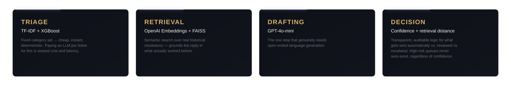
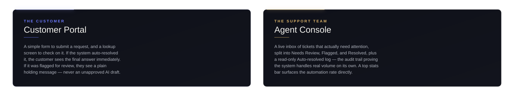
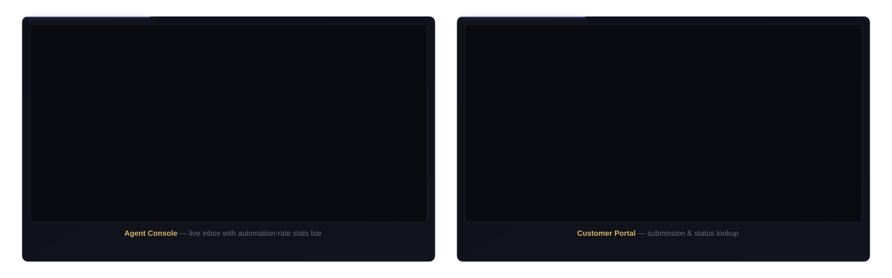

<div align="center">



<br/><br/>


&nbsp;&nbsp;

&nbsp;

&nbsp;

&nbsp;

&nbsp;
<a href="./LICENSE"></a>

</div>

<br/>

> ### The idea
>
> **AI-Ops** reads an incoming customer support ticket, decides which team should own it, pulls up how similar issues were actually resolved before, drafts a grounded reply, and decides **for itself** — based on its own confidence, not a hardcoded rule of thumb — whether to send that reply, hold it for a human to approve, or escalate immediately.
>
> It's not a chatbot with a nice UI. It's a triage system with a measurable automation rate.

<br/>

<div align="center">

<table>
<tr><td align="center">🎯</td><td><a href="#why-this-exists"><b>Why This Exists</b></a></td><td align="center">🧠</td><td><a href="#architecture"><b>Architecture</b></a></td><td align="center">🖥️</td><td><a href="#two-interfaces-one-pipeline"><b>Interfaces</b></a></td></tr>
<tr><td align="center">🛠️</td><td><a href="#tech-stack"><b>Tech Stack</b></a></td><td align="center">📊</td><td><a href="#results"><b>Results</b></a></td><td align="center">📁</td><td><a href="#project-structure"><b>Structure</b></a></td></tr>
<tr><td align="center">🚀</td><td><a href="#getting-started"><b>Getting Started</b></a></td><td align="center">🔌</td><td><a href="#api-usage"><b>API Usage</b></a></td><td align="center">🧪</td><td><a href="#testing"><b>Testing</b></a></td></tr>
<tr><td align="center">🖼️</td><td><a href="#screenshots"><b>Screenshots</b></a></td><td align="center">🧭</td><td><a href="#what-id-build-next"><b>What's Next</b></a></td><td align="center">💡</td><td><a href="#lessons-along-the-way"><b>Lessons</b></a></td></tr>
</table>

</div>

<br/>

## Why This Exists

Most "AI support bot" projects are a single LLM call wearing a UI. That's not what running this in production actually looks like — and it's not what this looks like either, on purpose.

**AI-Ops** is built the way a real support-intelligence system would be: a **classical ML model** does the cheap, deterministic job of routing (it doesn't need an LLM to know "this is a billing question"), a **retrieval layer** grounds every reply in what actually worked before, an **LLM** only gets involved where genuine language generation is required, and a **decision layer** weighs the model's own confidence and retrieval quality to decide whether a ticket can be safely auto-resolved, needs a human to approve the draft, or should skip straight to a person. Every layer earns its place — nothing is there just because it's trendy.

The project went through two phases. **Phase 1** built the pipeline end-to-end (classifier → RAG → agents → API). **Phase 2** — after realizing a working pipeline still just _felt_ like a chatbot — added persistence, real confidence scoring, and outcome-based decision logic, so the system actually behaves like a product with an audit trail instead of a stateless text-in, text-out demo.

<br/>

## Architecture

```mermaid
flowchart LR
    T([📨 Incoming Ticket]) --> TR{{Triage Agent}}
    TR -->|TF-IDF + XGBoost| Q[/Queue + Confidence/]
    T --> RT{{Retrieval Agent}}
    RT -->|OpenAI Embeddings + FAISS| CTX[/Top-k Similar Resolutions/]
    Q --> DR{{Drafting Agent}}
    CTX --> DR
    DR -->|GPT-4o-mini| RESP[/Grounded Draft Reply/]
    RESP --> DEC{{Decision Agent}}
    DEC -->|confidence + retrieval distance| OUT1([✅ Auto-resolved])
    DEC -->|confidence + retrieval distance| OUT2([📝 Needs Review])
    DEC -->|confidence + retrieval distance| OUT3([🚩 Escalated])
    OUT1 --> DB[(SQLite)]
    OUT2 --> DB
    OUT3 --> DB

    classDef ticket fill:#14161F,stroke:#6E7BFF,color:#F4F3EF,stroke-width:1.5px
    classDef agent fill:#14161F,stroke:#D9B26A,color:#F4F3EF,stroke-width:1.5px
    classDef out fill:#14161F,stroke:#3E8E7E,color:#F4F3EF,stroke-width:1.5px
    classDef store fill:#14161F,stroke:#6A6D76,color:#F4F3EF,stroke-width:1.5px
    class T,Q,CTX,RESP ticket
    class TR,RT,DR,DEC agent
    class OUT1,OUT2,OUT3 out
    class DB store
    linkStyle 0,1,2,3,4,5,6,7 stroke:#6E7BFF,stroke-width:1.4px,opacity:0.7
    linkStyle 8,9,10 stroke:#D9B26A,stroke-width:1.4px,opacity:0.7
    linkStyle 11,12,13 stroke:#6A6D76,stroke-width:1.2px,opacity:0.6
```



<div align="center">



</div>

<br/>

## Two Interfaces, One Pipeline

The same backend pipeline is consumed by two completely different surfaces:

<div align="center">



</div>

<sub>A third, minimal <b>Pipeline Inspector</b> view is kept separately as an internal/debugging tool — it visualizes each agent stage lighting up in sequence for a single ticket, useful for explaining the architecture, not for daily use.</sub>

<br/>

## Tech Stack

<div align="center">

|     Layer      | Tools                                                 |
| :------------: | :---------------------------------------------------- |
|      Data      | pandas · NumPy                                        |
|  Classical ML  | scikit-learn · XGBoost                                |
|   Retrieval    | OpenAI Embeddings · FAISS                             |
| Orchestration  | LangGraph                                             |
|   Generation   | OpenAI GPT-4o-mini                                    |
| Decision Logic | Confidence + retrieval-distance rules (`decision.py`) |
|  Persistence   | SQLite · SQLAlchemy                                   |
|   Evaluation   | RAGAS                                                 |
|    Serving     | FastAPI · Pydantic · Uvicorn                          |
|    Testing     | pytest · unittest.mock                                |
|   Packaging    | setuptools (`src/` layout, pip-installable)           |
|      Ops       | Docker · GitHub Actions                               |

</div>

<br/>

## Results

<div align="center">

**Classifier — 10-class ticket routing (`queue` prediction)**

| Model                                   | Accuracy | Macro F1 |
| --------------------------------------- | :------: | :------: |
| Logistic Regression + TF-IDF (baseline) |   46%    |   0.37   |
| **XGBoost + TF-IDF (final)**            | **50%**  | **0.44** |

</div>

Weaker on the smallest classes (`General Inquiry`, `Sales and Pre-Sales`) — a direct effect of class imbalance, documented below rather than silently ignored.

<div align="center">

**RAG pipeline — RAGAS evaluation (20-sample eval set)**

| Metric            |  Score  | What it measures                                    |
| ----------------- | :-----: | --------------------------------------------------- |
| Context Precision | `1.00`  | Are retrieved past tickets actually relevant?       |
| Faithfulness      | `0.672` | Does the draft stick to the retrieved context?      |
| Answer Relevancy  | `0.589` | Does the draft actually address the question asked? |

**Decision layer — automation outcome** <sub>(live system, via `/stats`)</sub>

</div>

| Outcome          | What it means                                                                                        |
| ---------------- | ---------------------------------------------------------------------------------------------------- |
| ✅ Auto-resolved | High confidence + strong retrieval match on a non-high-risk queue → sent with zero human involvement |
| 📝 Needs review  | Draft prepared, held for an agent to approve or edit before sending                                  |
| 🚩 Escalated     | Low confidence and/or weak retrieval match → routed straight to a human, no draft trusted            |

> 📈 _Automation rate (`% auto-resolved`) is computed live from real ticket volume via `GET /stats`._

<br/>

## Project Structure

<details>
<summary><b>Click to expand full tree</b></summary>

```
ai-ops/
├── notebooks/                # exploration & demos — thin, call into src/
├── src/ai_ops/
│   ├── data/                  # loading, cleaning
│   ├── models/                 # classifier + training script
│   ├── rag/                     # embeddings, retriever, knowledge base
│   ├── agents/                   # LangGraph nodes, decision logic, graph assembly
│   ├── db/                        # SQLAlchemy models, session, CRUD
│   ├── evaluation/                 # classification + RAGAS metrics
│   ├── api/                         # FastAPI app, routes, schemas
│   └── utils/                        # logging, io helpers
├── frontend/
│   ├── customer-portal/       # public-facing submission + status lookup
│   ├── agent-console/          # internal inbox, review, and auto-resolved log
│   └── pipeline-inspector/      # internal dev tool — visualizes a single ticket's flow
├── tests/                    # pytest — one file per module
├── data/                     # raw / processed / knowledge_base
├── models/                   # saved artifacts (gitignored)
├── configs/                  # config.yaml
├── scripts/                  # run_pipeline.py, evaluate.py
├── .github/workflows/        # CI
├── Dockerfile
├── docker-compose.yml
└── pyproject.toml
```

</details>

<br/>

## Getting Started

<details open>
<summary><b>Click to expand setup instructions</b></summary>

```bash
# 1. Clone
git clone https://github.com/Jenil05-web/ai-ops.git
cd ai-ops

# 2. Create environment & install
python -m venv venv
source venv/bin/activate          # Windows: venv\Scripts\activate
pip install -e .

# 3. Set your OpenAI key
cp .env.example .env              # then fill in OPENAI_API_KEY

# 4. Run the pipeline
python -m ai_ops.data.cleaning          # clean raw data
python -m ai_ops.models.train           # train the classifier
python -m ai_ops.rag.knowledge_base     # build embeddings + FAISS index

# 5. Initialize the database
python -c "from ai_ops.db.database import init_db; init_db()"

# 6. Serve the API
uvicorn ai_ops.api.main:app --reload --app-dir src
```

Visit `http://127.0.0.1:8000/docs` for interactive Swagger docs. Open `frontend/agent-console/index.html` and `frontend/customer-portal/index.html` directly in a browser to use the two interfaces.

</details>

<br/>

## API Usage

**Submit a ticket through the full pipeline** <sub>(persists to DB, returns a routing decision)</sub>

```bash
curl -X POST "http://127.0.0.1:8000/tickets?customer_email=jane@example.com&subject=Billing+question&body=I+was+charged+twice+this+month"
```

```json
{
  "id": "31245b42",
  "predicted_queue": "Billing and Payments",
  "confidence": 0.99,
  "status": "needs_review",
  "draft_response": "We apologize for the inconvenience...",
  "retrieved_context": "[ ... ]",
  "created_at": "2026-07-29T18:54:09"
}
```

**Check live automation stats**

```bash
curl "http://127.0.0.1:8000/stats"
```

```json
{
  "total": 12,
  "auto_resolved": 9,
  "needs_review": 2,
  "escalated": 1,
  "automation_rate": 75.0
}
```

<div align="center">

| Method | Endpoint                       | Description                                                                |
| :----: | ------------------------------ | -------------------------------------------------------------------------- |
|  GET   | `/tickets?status=needs_review` | List tickets filtered by status                                            |
|  GET   | `/tickets/{id}`                | Fetch a single ticket by ID                                                |
|  POST  | `/tickets/{id}/reply`          | Approve / send a reviewed draft                                            |
|  POST  | `/process-ticket`              | Original single-shot call, no persistence — used by the Pipeline Inspector |

</div>

<br/>

## Testing

```bash
pytest tests/ -v
```

Every module — cleaning, classifier, RAG, agents, decision logic, and API — is unit tested with mocked external calls (no live API cost to run the suite).

<br/>

## Screenshots

<div align="center">



</div>

<br/>

## What I'd Build Next

Deliberately scoped out of this MVP — not forgotten, just sequenced:

- [ ] Fine-tune a small open model on drafting, instead of prompting GPT-4o-mini
- [ ] Priority prediction (currently only `queue` is classified)
- [ ] Class imbalance handling (SMOTE / class weighting) for minority queue categories
- [ ] Skip drafting entirely for immediate-escalation cases, to save LLM cost on tickets that will be escalated regardless
- [ ] Real-time updates via WebSockets instead of polling in the Agent Console
- [ ] Email notification to the customer once a reviewed reply is sent
- [ ] Basic auth on the Agent Console
- [ ] Real-time monitoring dashboard (latency, cost per ticket, drift detection)

<br/>

## Lessons Along the Way

- My first dataset choice looked fine on paper — until I actually _read_ the rows and found the labels had no real relationship to the text. Caught it before building three layers on top of broken data.
- A perfect retrieval score doesn't mean a good system — my RAG context precision was `1.00` while the drafted answers still scored poorly, because the problem was prompt design, not retrieval.
- "The metric didn't move" turned out to be a stale Jupyter kernel, not a bad idea — always verify your code is actually the code you think it is before trusting a number.
- After finishing the entire pipeline, it still felt like a chatbot — because every ticket ended up in front of a human either way. The fix wasn't more AI, it was adding a decision layer that used the model's own confidence to let _some_ tickets resolve with zero human involvement, and building a UI that could prove it with a real number.

<br/>

<div align="center">


</div>
