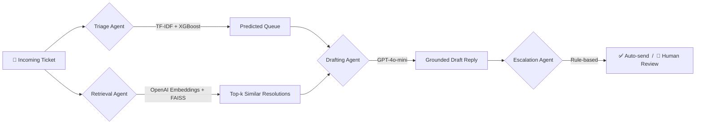

<div align="center">


<br/>


<br/><br/>


</div>

<br/>

> **Triage** reads an incoming customer support ticket, figures out which team should own it, pulls up how similar issues were actually resolved in the past, drafts a grounded reply, and decides on its own whether a human needs to step in — all as one orchestrated pipeline, not a single prompt pretending to be a product.

<br/>

## Table of Contents

- [Why This Exists](#why-this-exists)
- [Architecture](#architecture)
- [Tech Stack](#tech-stack)
- [Results](#results)
- [Project Structure](#project-structure)
- [Getting Started](#getting-started)
- [API Usage](#api-usage)
- [Testing](#testing)
- [Screenshots](#screenshots)
- [What I'd Build Next](#what-id-build-next)
- [Lessons Along the Way](#lessons-along-the-way)
- [Author](#author)

<br/>

## Why This Exists

Most "AI support bot" projects are a single LLM call wearing a UI. That's not what running this in production actually looks like.

**Triage** is built the way a real support-intelligence system would be: a **classical ML model** does the cheap, deterministic job of routing (it doesn't need an LLM to know "this is a billing question"), a **retrieval layer** grounds every reply in what actually worked before, an **LLM** only gets involved where genuine language generation is required, and a **rule-based layer** decides when a human has to be in the loop. Every layer earns its place — nothing is there just because it's trendy.

<br/>

## Architecture



| Stage | Approach | Why not just "ask the LLM"? |
|---|---|---|
| **Triage** | TF-IDF + XGBoost | Fixed category set → cheap, instant, deterministic. Paying an LLM per ticket for this is wasted cost and latency. |
| **Retrieval** | OpenAI embeddings + FAISS | Semantic search over real historical resolutions — grounds the reply in what actually worked. |
| **Drafting** | GPT-4o-mini | The one step that genuinely needs open-ended language generation. |
| **Escalation** | Rule-based | Transparent, auditable logic for what gets human review — no black box on a compliance-relevant decision. |

<br/>

## Tech Stack

<div align="center">

| Layer | Tools |
|---|---|
| Data | pandas, NumPy |
| Classical ML | scikit-learn, XGBoost |
| Retrieval | OpenAI Embeddings, FAISS |
| Orchestration | LangGraph |
| Generation | OpenAI GPT-4o-mini |
| Evaluation | RAGAS |
| Serving | FastAPI, Pydantic, Uvicorn |
| Testing | pytest, unittest.mock |
| Packaging | setuptools (`src/` layout, pip-installable) |
| Ops | Docker, GitHub Actions |

</div>

<br/>

## Results

**Classifier — 10-class ticket routing (`queue` prediction)**

| Model | Accuracy | Macro F1 |
|---|---|---|
| Logistic Regression + TF-IDF (baseline) | 46% | 0.37 |
| **XGBoost + TF-IDF (final)** | **50%** | **0.44** |

Weaker on the smallest classes (`General Inquiry`, `Sales and Pre-Sales`) — a direct effect of class imbalance, documented below rather than silently ignored.

**RAG pipeline — RAGAS evaluation (20-sample eval set)**

| Metric | Score | What it measures |
|---|---|---|
| Context Precision | `1.00` | Are retrieved past tickets actually relevant? |
| Faithfulness | `0.738` | Does the draft stick to the retrieved context? |
| Answer Relevancy | `0.653` | Does the draft actually address the question asked? |

faithfulness and relevancy improved materially after iterating on the drafting prompt._

<br/>

## Project Structure

<details>
<summary><b>Click to expand full tree</b></summary>

```
triage/
├── notebooks/              # exploration & demos — thin, call into src/
├── src/triage/
│   ├── data/                # loading, cleaning
│   ├── models/               # classifier + training script
│   ├── rag/                  # embeddings, retriever, knowledge base
│   ├── agents/                # LangGraph nodes + graph assembly
│   ├── evaluation/             # classification + RAGAS metrics
│   ├── api/                   # FastAPI app, routes, schemas
│   └── utils/                   # logging, io helpers
├── tests/                   # pytest — one file per module
├── data/                    # raw / processed / knowledge_base
├── models/                  # saved artifacts (gitignored)
├── configs/                 # config.yaml
├── scripts/                 # run_pipeline.py, evaluate.py
├── .github/workflows/       # CI
├── Dockerfile
├── docker-compose.yml
└── pyproject.toml
```

</details>

<br/>

## Getting Started

<details>
<summary><b>Click to expand setup instructions</b></summary>

```bash
# 1. Clone
git clone https://github.com/Jenil05-web/triage.git
cd triage

# 2. Create environment & install
python -m venv venv
source venv/bin/activate          # Windows: venv\Scripts\activate
pip install -e .

# 3. Set your OpenAI key
cp .env.example .env              # then fill in OPENAI_API_KEY

# 4. Run the pipeline
python -m triage.data.cleaning          # clean raw data
python -m triage.models.train           # train the classifier
python -m triage.rag.knowledge_base     # build embeddings + FAISS index

# 5. Serve the API
uvicorn triage.api.main:app --reload --app-dir src
```

Visit `http://127.0.0.1:8000/docs` for interactive Swagger docs.

</details>

<br/>

## API Usage

```bash
curl -X POST http://127.0.0.1:8000/process-ticket \
  -H "Content-Type: application/json" \
  -d '{"ticket_text": "My internet connection keeps dropping"}'
```

```json
{
  "ticket_text": "My internet connection keeps dropping",
  "predicted_queue": "Technical Support",
  "retrieved_context": [ { "subject": "...", "answer": "...", "distance": 0.76 } ],
  "draft_response": "...",
  "escalated": false
}
```

<br/>

## Testing

```bash
pytest tests/ -v
```

Every module — cleaning, classifier, RAG, agents, API — is unit tested with mocked external calls (no live API cost to run the suite).

<br/>

## Screenshots

<!-- Add screenshots here, e.g.:
<div align="center">


</div>
-->


<br/>

## What I'd Build Next

Deliberately scoped out of this MVP — not forgotten, just sequenced:

- [ ] Fine-tune a small open model on drafting, instead of prompting GPT-4o-mini
- [ ] Priority prediction (currently only `queue` is classified)
- [ ] Class imbalance handling (SMOTE / class weighting) for minority queue categories
- [ ] Real-time monitoring dashboard (latency, cost per ticket, drift detection)
- [ ] Conditional graph routing (skip drafting entirely for critical-priority tickets)

<br/>

## Lessons Along the Way

- My first dataset choice looked fine on paper — until I actually *read* the rows and found the labels had no real relationship to the text. Caught it before building three layers on top of broken data.
- A perfect retrieval score doesn't mean a good system — my RAG context precision was `1.00` while the drafted answers still scored poorly, because the problem was prompt design, not retrieval.
- "The metric didn't move" turned out to be a stale Jupyter kernel, not a bad idea — always verify your code is actually the code you think it is before trusting a number.

<br/>

## Author

Built by **Jenil**  
[](https://github.com/Jenil05-web)

<br/>


</div>